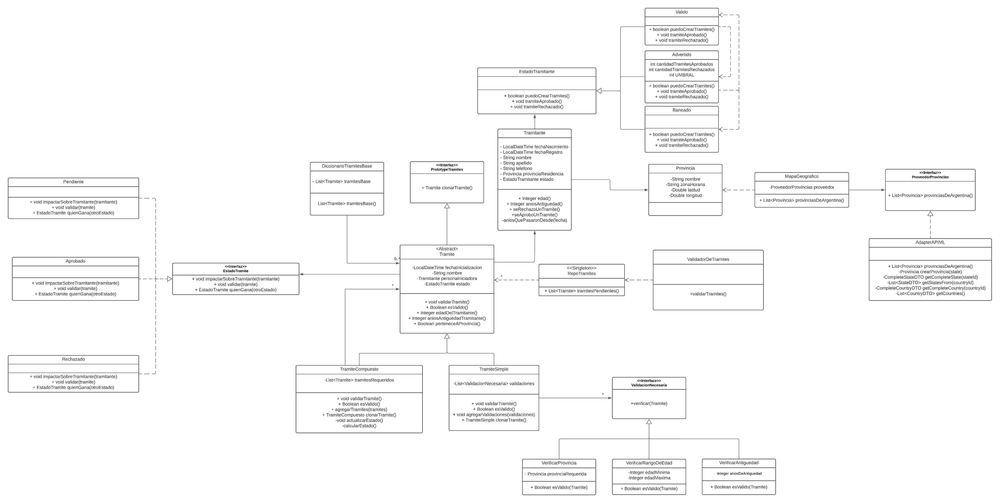
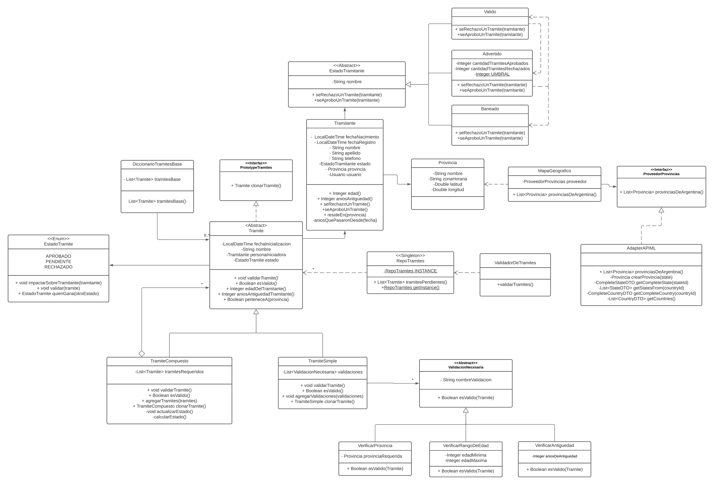
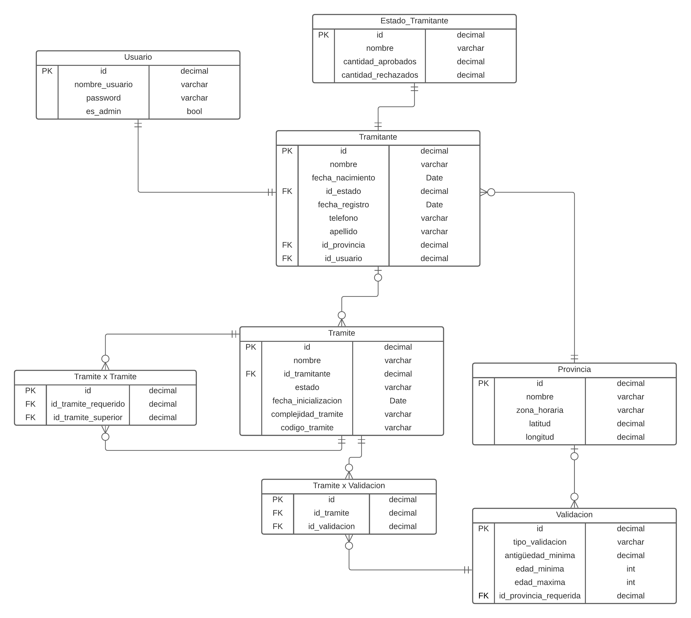
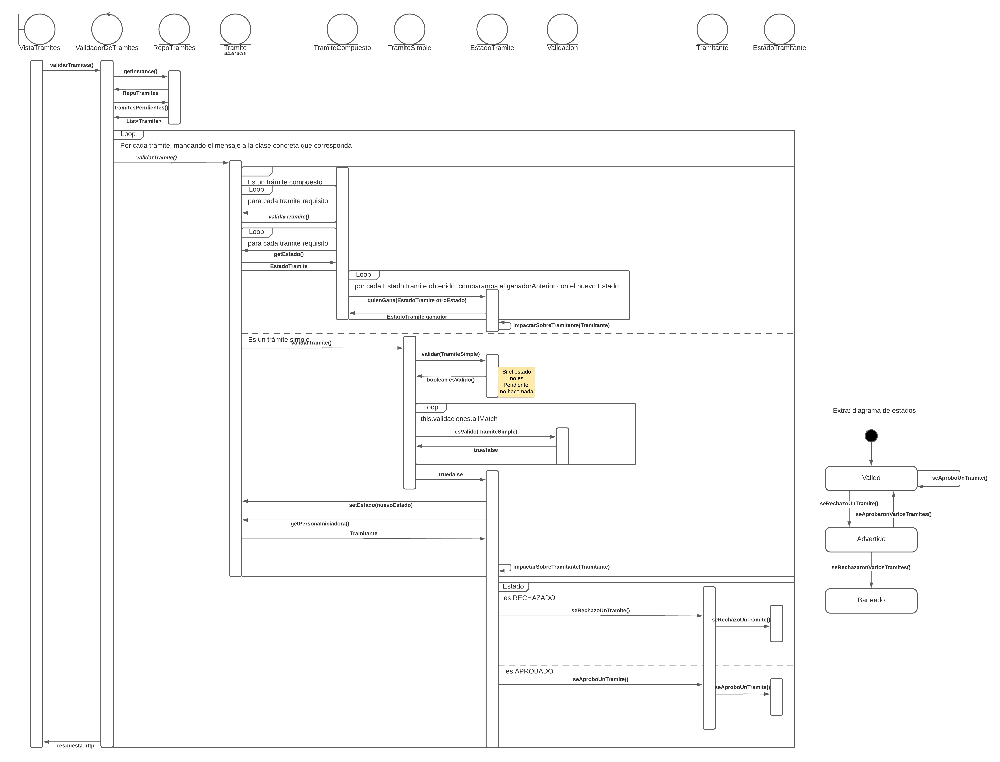

# Pseudo Parcial Diseño de Sistemas

## Consigna

Generar un dominio el cual nos permita modelar con objetos y utilizar diversos patrones de diseño. Se deben justificar las decisiones de diseño que se tomen. Se debe diseñar un Diagrama de Clases, DER y Diagrama de Secuencia. Tener en cuenta las diferentes incompatibilidades entre el modelado de objetos y el relacional.

Se debe generar una codificación parcial de la solución propuesta. Se debe conectar a una DB para poder leer y guardar información. Además, se debe consumir una API de terceros a elección (nosotros elegimos la de Mercadolibre, que nos permite acceder a Países, Provincias y Ciudades).

### Nota

Este trabajo se realizó en conjunto con Cristian Manuel Cali. El objetivo no era crear una aplicación completamente funcional, sino generar un dominio que nos permita aplicar los conocimientos de la materia.

Podrán observar que muchas cosas quedaron pendientes o que la consigna no está del todo completa. Una de las cosas que hubiera estado bueno agregar es utilizar un ORM como Hibernate para hacer la parte del modelo relacional, la implementación de repositorios y conexiones a la DB.

## Tramifácil - Sistema de gestión de trámites

### Contexto general simplificado de la aplicación

Un trámite puede ser aprobado o rechazado, y se conocen dos tipos de trámites: Compuestos y Simples. Los compuestos están constituidos por otros trámites, y para ser aprobados requieren que todos sus subtrámites estén aprobados. Los Simples para ser aprobados deben pasar diversas validaciones (tener en cuenta que pueden aparecer nuevas a través del tiempo). Una validación posible podríá ser que la provincia del Trámite y del Tramitante coincidan.

Un trámite Compuesto será rechazado (no aprobado) cuando cualquiera de sus trámites haya sido rechazado. Uno Simple será rechazado cuando no cumpla con alguna de las validaciones.

Se debe contar con trámites predefinidos por usuarios administradores que permitan generar de forma rápida otros trámites a partir de una configuración en particular. Se deben poder generar otros trámites predefinidos sin la necesidad de hacer modificaciones sobre el código. Un trámite predefinido o base no tendrá un tramitante asociado, estará aprobado por defecto y no debería tener fecha de inicialización.

Se debe:
- Permitir a un administrador crear nuevos trámites base.
- Permitir a un usuario iniciar un trámite Compuesto o Simple a partir de un trámite base. Dicho trámite debe quedar marcado como _PENDIENTE_ para su validación.
- Permitir a un administrador iniciar el proceso de validación de trámites pendientes.
- Permitir que al aprobar o rechazar un trámite pendiente, este pueda impactar sobre el estado del trámite.

### Diagrama de Clases

### Algunos Patrones de Diseño utilizados

**Prototype (Creacional):** Implementado con la interfaz _PrototypeTramites_. Nos permite guardar templates de tramites en la DB con información parcial. Esto facilita crear nuevos trámites a partir de esa configuración. Además, para generar nuevos templates solamente habría que instanciar objetos y persistirlos (o directamente agregar una fila al registro).

**State (de comportamiento):** Implementado con la clase _EstadoTramitante_. Nos permite modelar el cambio de comportamiento de una abstracción en base a su estado. Si bien definimos transiciones, lo único que se delega al state es el cambio de estado en sí. No una lógica de dominio que dependa del estado, por lo cual no quedó bien justificado del todo.

**Adapter (Estructural):** Implementado mediante la interfaz _ProveedorProvincias_. Nos sirve para poder definir nuestra propia interfaz para obtener la lista de provincias de Argentina y no acoplarnos al proveedor de las mismas. Delegamos toda la complejidad de consumir la API de mercadolibre al adaptador correspondiente. Además, si en un futuro quisiéramos cambiar de proveedor no sería tan complicado. Tendríamos que crear un nuevo Adaptador, pero no haría falta modificar nuestro código.

**Composite (Estructural):** Implementado mediante la clase abstracta _Tramite_. Nos permite modelar una forma de árbol, ya que podemos tener trámites simples y trámites compuestos por otros trámites (simples y compuestos). Podemos modelar un conjunto y tratarlo como si fuera un individuo. Esto nos sirve para corroborar la validez de un trámite. Para los simples debe pasar todas las validaciones. Pero para los compuestos, todos sus trámites deben ser válidos.

**Singleton (Creacional):** Implementado con la clase RepoTramites. Nos permite controlar la cantidad de instancias que puede tener una clase. Esto nos sirve para controlar el acceso a un recurso compartido como la DB con una única conexión. Además de que nos proporciona un único punto de acceso para dicha instancia. Se puede acceder desde cualquier parte del código.

### Diagrama de Clases Persistible

**Impedance Mismatch:** al pasar del modelo de objetos al relacional, existen ciertas características que no pueden ser transformadas de forma lineal o directa por las incompatibilidades entre los modelos. Se listan algunos cambios que se tuvieron que hacer sobre el modelo original para poder ser persistido:
- Cambiar las interfaces por clases abstractas. Esto nos permite tener una entidad persistible con una clase concreta. O en su defecto, cambiarla por un Enum con comportamiento.
- Agregar atributos como IDs para poder identificarlos y utilizarlos como PK.
- Si se utiliza herencia elegir una de las estrategias de mapeo de herencia e implementarla. Nosotros fuimos por _Single Table_ porque nos ahorraría bastantes Joins, que mejoran la performance de la query a la DB. La desventaja es que vamos a tener muchos campos en null por el hecho de combinar todas las abstracciones en una sola tabla. Pero creemos que vale la pena ya que las abstracciones son pocas y sus atributos también.
- Si hubiéramos utilizado un ORM deberíamos haber agregado una serie de _annotations_ para hacer la transformación al modelo relacional.

### DER

### Diagrama de Secuencia - Validación de Trámite

